# AI-Based Flower Instance Detection and Picking Optimization
## Chapter 1 - Task Introduction
### 1.PROBLEM STATEMEN
When flowers are harvested in the greenhouse or from the field, they are typically collected into a boundled heap. Before they can be processed by a machine, the flowers must currently be picked up manually, one by one, from the pile and placed into the machine. This task is labor-intensive and complicated further by the fact that flowers are often entangled.

Thus, automating this process would significantly reduce manual labor. The critical point is that the flower must first be individually identified. This assignment focuses on designing a setup to capture and map the flowers, using AI to detect the individual flower instances, and determining which flower is best suited to be picked first from the pile (output the pickup coordinates for the manipulator).
### 2.Solution
The objective of this project is to determine the optimal picking coordinates for the uppermost flower in a tangled pile, utilizing raw visual data. To achieve this, a comprehensive perception pipeline has been developed, integrating a deep neural network for instance segmentation with three specialized post-processing algorithms for structural analysis and selection. The execution is organized into three distinct stages:
* **Dataset creation and Preprocessing**:  All images are collected using a prototype setup, where flowers are heaped on a desk and captured by an overhead camera that takes top-down images of the flower pile. 
    `Roboflow` is employed as an online tool to facilitate data annotation and data augmentation.
* **Instance Segmentation**: A `Mask-RCNN` neural network is trained to detect all stem segments.
* **Post Processing**: (1) The first post-processing algorithm, `Stem Pairing`, is designed to associate stem segments belonging to the same flower.(2) The second post-processing algorithm, `Top Selection`, selects the topmost flower in the batch based on geometric occlusion information. (3) The third post-processing algorithm, `Pick Point`, generates a single picking point based on the masks of the selected top flower.
The overall pipeline of the proposed system is illustrated below:

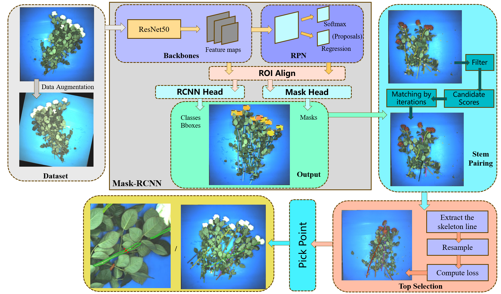 
<em>Fig. 1. Pipeline of the proposed system.</em>

## Chapter 2 - Dataset creation and Preprocessing
### Image Acquisition
A total of 50 raw images are captured from flower piles containing between one and ten flowers arranged with random positions and orientations. All images are acquired from a fixed top-down viewpoint. Illumination conditions are controlled using an auxiliary light source mounted next to the camera to ensure consistent brightness across the dataset.
### Image annotation
Image annotation is performed using the online data processing tool `Roboflow`. 
Polygon-based annotations are employed to generate ground-truth segmentation masks by manually outlining the contours of stem segments. 
For model training, two semantic classes are defined: `Stem` and `Flower`. 
The annotated dataset is exported in COCO JSON format.

 
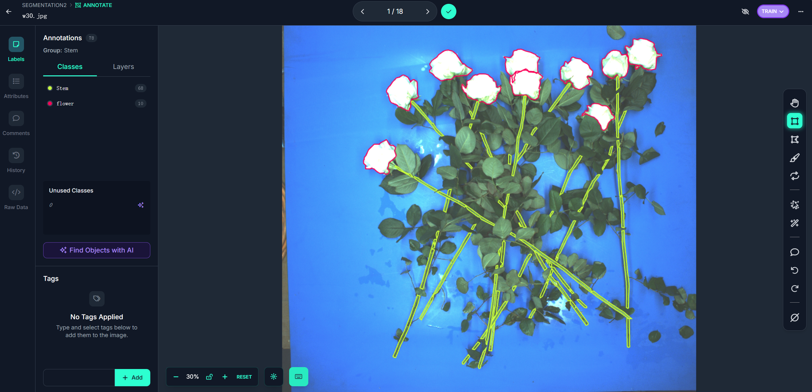 
<em>Fig. 2. Example of annotated stem segmentation masks.</em>

To facilitate the evaluation of post-processing algorithms, additional labels are included in the annotation files, such as ground-truth stem clusters and pickability indicators. 

Data augmentation techniques are then applied to expand the dataset from 50 raw images to 275 images. 
The applied augmentation methods are summarized as follows:

* **Flip**: Horizontal
* **Rotation**: Between -15 $^\circ$ and +15 $^\circ$
* **Hue**: Between -20 $^\circ$ and +20 $^\circ$
* **Saturation**: Between -25% and +25%
* **Brightness**: Between -20% and +20%
* **Noise**: Up to 0.3% of pixels

## Chapter 3 - Instance Segmentation

 
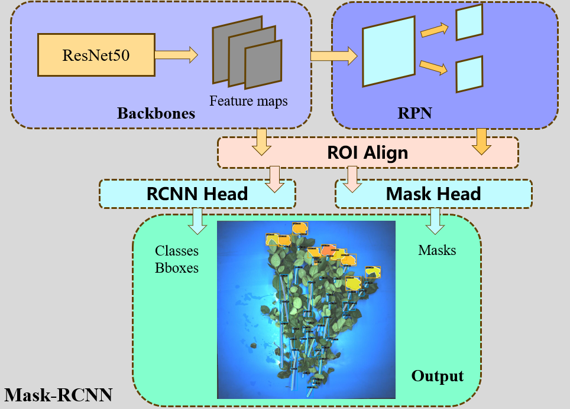 
<em>Fig. 3. Mask-RCNN model structure.</em>

A comparative analysis of two prominent instance segmentation frameworks—YOLO and Mask R-CNN—revealed a distinct trade-off between mask fidelity and operational versatility. While Mask R-CNN variants consistently deliver superior segmentation precision, the YOLO series demonstrates significant advantages in deployment compatibility, particularly within resource-constrained industrial environments.

### Mask-RCNN
Mask R-CNN is a seminal two-stage instance segmentation algorithm that extends the Faster R-CNN object detector by incorporating a dedicated mask branch. The architecture utilizes a `Region Proposal Network (RPN)` to generate candidate object regions, followed by three parallel heads that perform `classification`, `bounding box regression`, and `pixel-level segmentation`.
The key features of this framework include:

* **wo-Stage Architecture**:  Adopts a coarse-to-fine approach, where potential regions are proposed first and then refined for final detection.
* **RPN Dependency**: Heavily relies on the Region Proposal Network to suggest regions of interest (RoIs), ensuring high recall in cluttered environments.
* **High Precision**: Offers superior segmentation accuracy, particularly in complex scenarios like flower pile detection, due to its precise spatial alignment (RoI Align).

 
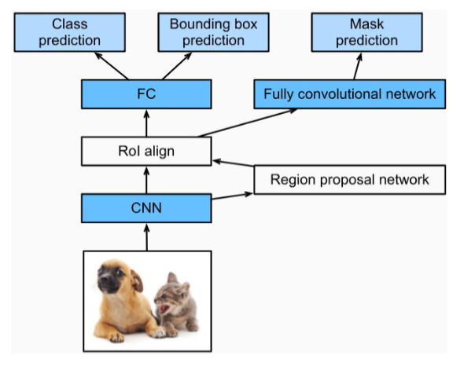 
<em>Fig. 4. Mask-RCNN illustation.</em>

### YOLO
YOLO (You Only Look Once) is a prominent one-stage object detection framework that performs inference based on a grid-based spatial division of the input image. Its instance segmentation variant, `YOLO-Seg`, extends this architecture by incorporating a mask-prediction head alongside the standard detection branches. This head utilizes a `Fully Convolutional Network (FCN)` to generate a series of semantic "prototype" masks, which are then linearly combined using instance-specific coefficients and clipped to the detected bounding box.

The key characteristics of the YOLO-Seg framework include:

* **One-Stage Pipeline**: Enables end-to-end training and inference, significantly reducing computational latency.
* **Grid-Based Inference**: Relies on a predefined spatial grid for object localization and mask generation, ensuring architectural
* **Real-Time Performance**: Specifically optimized for high-speed processing, making it ideal for time-critical industrial deployments.
* **Segmentation Fidelity**: While highly efficient, it produces relatively coarser masks compared to two-stage architectures, particularly in high-overlap scenarios.

 
 
<em>Fig. 5. YOLO illustation.</em>

### Comparision 
According to the underlying architectures of each model, they present distinct advantages and inherent limitations. Mask R-CNN achieves high mask detection accuracy by extracting features from multiple scales. However, this mechanism often fails when detecting long, thin, or inclined stems. Because the mask head resizes all Regions of Interest (RoIs) into a fixed, low-resolution grid (e.g., $28 \times 28$), a slender stem spanning a large RoI suffers from severe quantization errors. This results in a series of disjointed pixels rather than a continuous, intact structure. In contrast, YOLO avoids this specific downsampling bottleneck by performing inference across a global spatial grid. Nevertheless, its reliance on low-resolution prototype masks typically yields a higher recall at the expense of precision, leading to coarser boundaries 

 
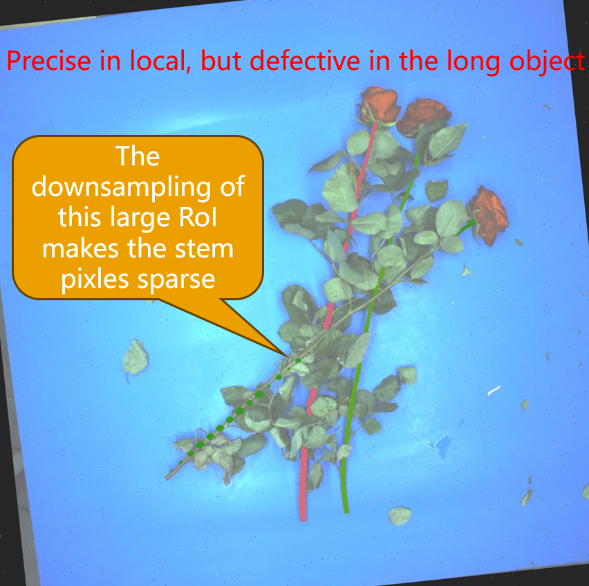
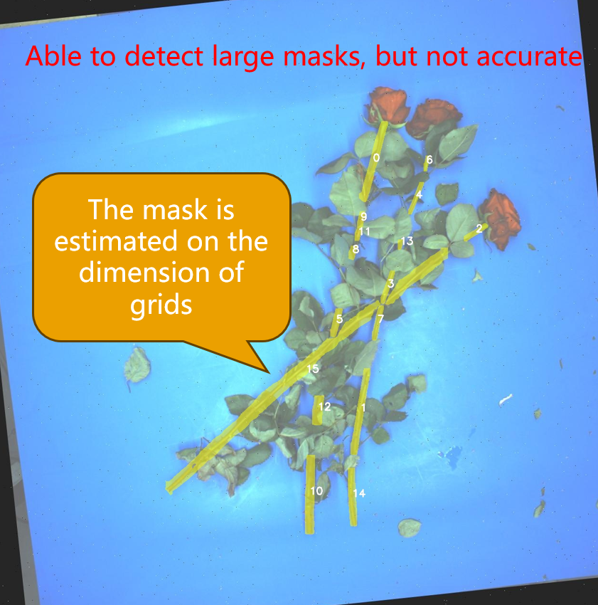 
<em>Fig. 6. Comparison of stem segmentation results: Mask R-CNN (left) vs. YOLO-Seg (right).</em>

In conclusion, achieving high-fidelity stem mask detection is a critical prerequisite for both the subsequent post-processing algorithms and the stringent precision requirements of robotic manipulator operations. Given the necessity for maintaining structural integrity when identifying slender flower stems, the `Mask R-CNN` framework—implemented via the `MMDetection` toolbox—was selected as the primary model for this research. 

Its superior ability to maintain pixel-level accuracy and minimize temporal or structural desynchronization during detection makes it the most suitable candidate for the next stages of development. Unlike one-stage alternatives that may compromise on boundary precision, Mask R-CNN ensures that the generated masks provide a reliable foundation for calculating optimal pickup points.The result is shown as below:

 
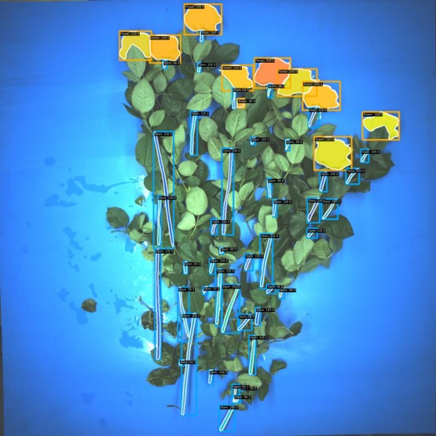 
<em>Fig. 7. Mask-RCNN Result.</em>

## Chapter 4 - Post Processing
Identifying individual instance segments is insufficient for determining which flower sits at the apex of a pile. All stem segments must proceed through a three-stage pipeline to transform raw masks into actionable picking coordinates: (1) Clustering disjointed segments into coherent flower structures. (2) Analyzing spatial relationships to identify the flower on the top of the pile. (3) Calculating and outputting the optimal pick point for robotic execution.

### Algorithm 1 - Stem Pairing
A mathematical clustering framework is implemented to group stem segments detected by the Mask R-CNN model. As shown in Figure below, each detected mask is processed using `Principal Component Analysis (PCA)` to calculate essential geometric properties, such as the stem centroid, upward direction vector, and length.

Based on these features, each segment is evaluated as a candidate "base stem" and paired with others through a four-phase logic:

* **Candidate Filtering**: Narrowing the search space based on spatial proximity.
* **Scoring**: Calculating a compatibility score for potential pairs based on alignment and colinearity.
* **Iterative Matching**: Performing a matching sequence to resolve complex clusters.
* **Patch Refinement**: Applying final corrections to ensure structural continuity.

 
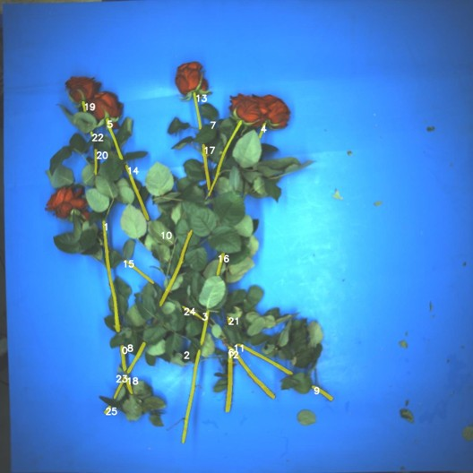
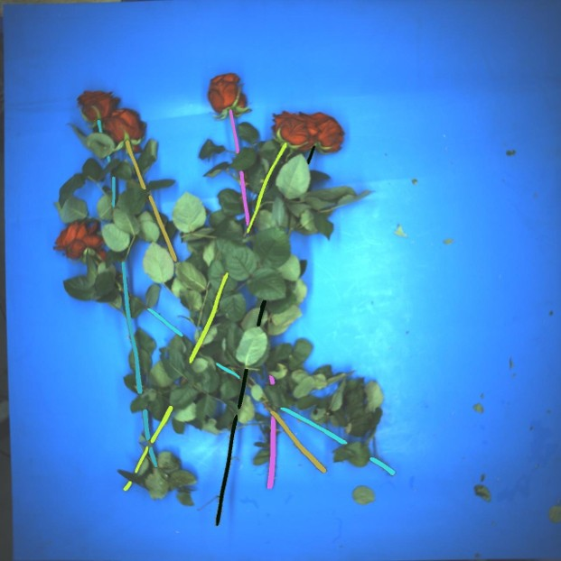 
<em>Fig. 8. Stem Pairing Visalization.</em>

#### **Phase 1. Filtering the candidate**
To optimize computational efficiency, each stem segment serves as a reference base to filter potential pairing candidates according to their orientation and positional deviations. This filtering phase relies on specific geometric assumptions to define valid search spaces:  
* **Assumption 1**: Two opposing sectors (upper and lower) with an internal angle of $40^\circ$ are projected from the longitudinal axis of each base stem. These regions define the permissible curvature of a single flower stem, effectively filtering out candidates that exceed realistic bending limits or positional offsets.

 
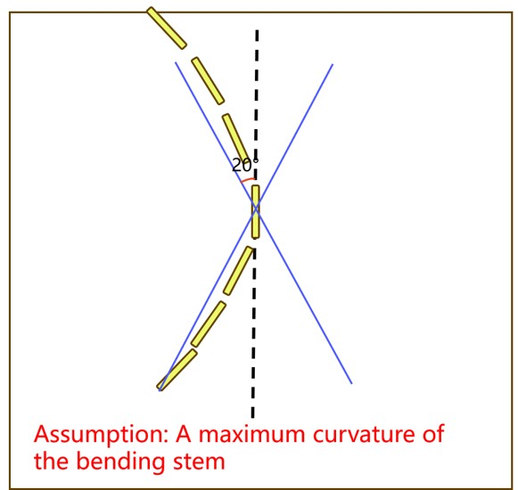 
<em>Fig. 9. Sector-Based Search Space.</em>

  

* **Assumption 2**: The permissible `orientation error` ($ang$) is dynamically constrained by the `positional error` ($ang_{pos}$) relative to the base stem. These metrics are defined as follows:

  (1) $ang_{pos}$ (Positional Error): The angular deviation of the candidate segment's centroid from the longitudinal axis (the infinite extension line) of the base stem.

  (2) $ang$ (Orientation Error): The angular difference between the directional vectors of the candidate and the base stem.

  To ensure that paired segments can be reconstructed as a coherent, straight line, the algorithm requires that candidates with minimal positional offsets also exhibit low orientation errors. This relationship is governed by the following inequality:

  $$ang < 15^\circ + ang_{pos}$$

  where $15^\circ$ is a heuristically tuned threshold. 

  Furthermore, a reciprocal tolerance is applied to filter out unrealistic "kinking" or sharp bending within each sector area:

  $$ang_{pos} < 15^\circ + ang$$

  This reciprocal constraint ensures that any spatial displacement remains proportional to the orientation change, thereby maintaining the structural integrity of the reconstructed stem clusters.
  
 
  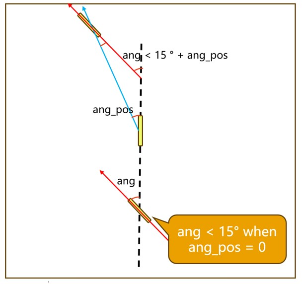
  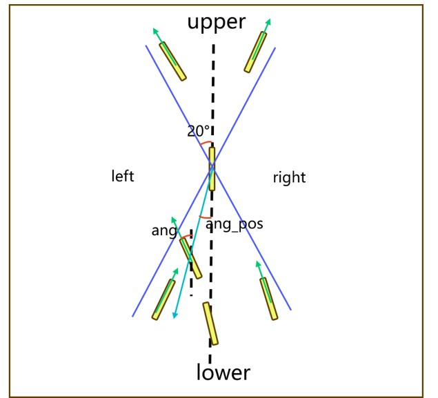 
  <em>Fig. 10. Colinearity Constraint (left) and Bending Tolerance (right)</em>
  

  Following the geometric filtering process, the search space for each base segment is significantly narrowed. Consequently, each stem retains only a limited number of viable pairing candidates. These potential matches, characterized by their adherence to the defined angular and positional constraints, are highlighted in green in figure below:
  
 
  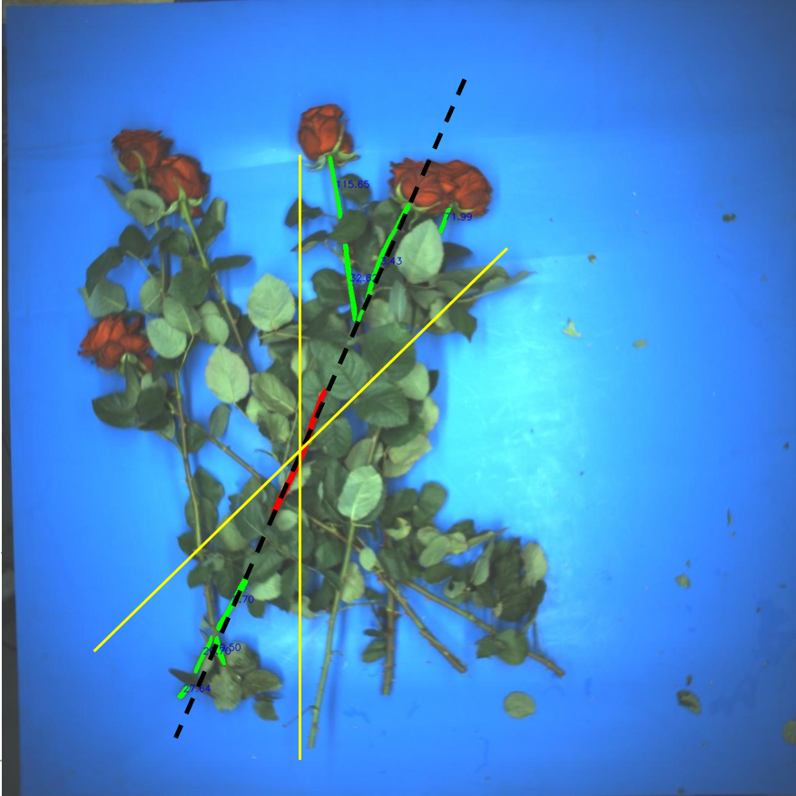 
  <em>Fig. 11. Stem candidates.</em>
  

#### **Phase 2. Compute the candidates' score**
To quantify the geometric compatibility between the base stem and its candidates, a scoring function is defined to integrate both positional and orientation deviations:

$$
\mathrm{Score} = r \cdot \frac{\mathrm{ang}}{\mathrm{length\_score}}
$$

In this formulation, `ang` represents the orientation error and `r` is the distance from the candidate's centroid to the intersection point of the two stem vectors. Geometrically, the `Score` corresponds to the arc length visualized in green in figure below. A lower score signifies a more coherent alignment, indicating that the candidate is a strong match for the base stem. 

 
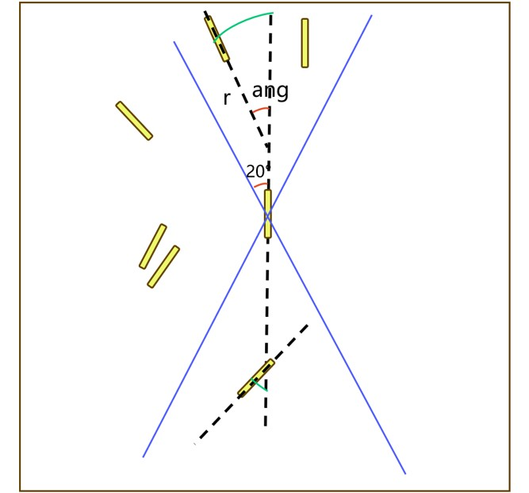 
<em>Fig. 12. Candidates score.</em>

The calculated scores, previously visualized in blue in figure below, are archived in a `global list` to facilitate efficient retrieval during optimization. To maintain structural consistency during the iterative pairing process, a unified indexing system is adopted:

 
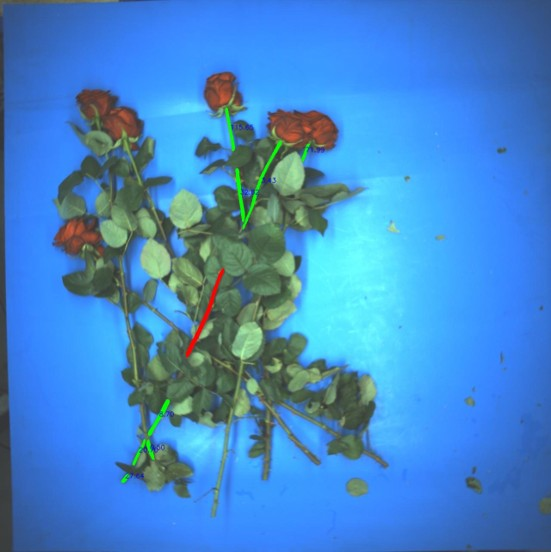
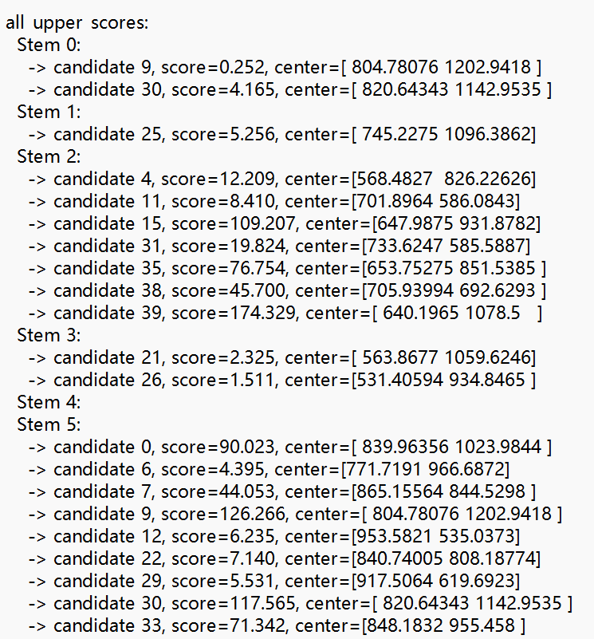 
<em>Fig. 13. Global List Storage.</em>

#### **Phase 3. Iterative Matching and Clustering**
The algorithm executes a global pairing sequence by treating each segment $i \in \{1, \dots, n\}$ as a reference base. For each `base stem i`, potential candidates $j$ are evaluated using a bidirectional scoring logic to identify the most geometrically consistent pairs.

 
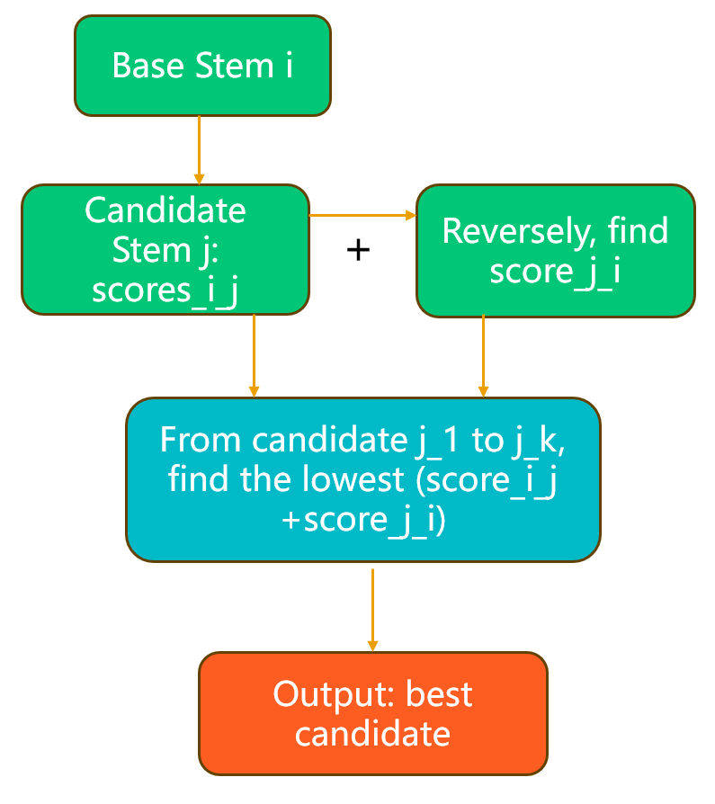 
<em>Fig. 14. Bidirectional Matching Rule.</em>

`Base stem i` will traverse through all candidates searching for the minimum sum-up score. For `candidate j`, it will look for $score_{ij}$ and ,reversely, $score_{ji}$. The lowest score combination represents that they are overall best matched. $score_{ij}$ and $score_{ji}$ are defined as follow:

* **$score_{ij}$**: The geometric deviation of candidate $j$ relative to base $i$.
* **$score_{ji}$**: The geometric deviation of candidate $i$ relative to base $j$.

Each segment possesses an `upper` and `lower` sector. If a match is established in the `upper` area, the segment remains available for pairing only through its `lower` area, and vice versa.  
Successfully paired segments are flagged and removed from the active search list.

 
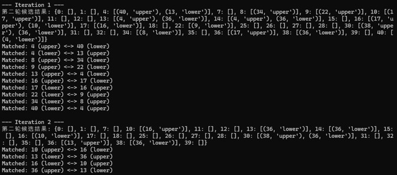 
<em>Fig. 15. Graph-Based Clustering.</em>

The process terminates when the candidate pool is exhausted or no pairs meet the threshold. The resulting connected components in the graph are stored as `flower clusters`:

 
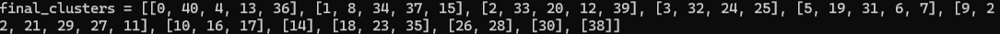 
<em>Fig. 16. Final Cluster.</em>

#### **Phase 4. Heuristic Patches for Exception Handling**
To address geometric ambiguities such as misalignments and fragmented clusters, three heuristic patches were implemented to refine the results of the iterative matching algorithm.

##### **Patch 1. Consistency identification for crossroad problem**
The PCA-based direction estimation is occasionally susceptible to mask noise, leading to the "crossroad problem" where a base stem forms inconsistent matches in figure below:

 
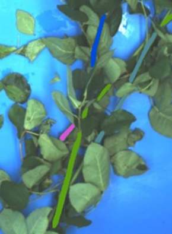
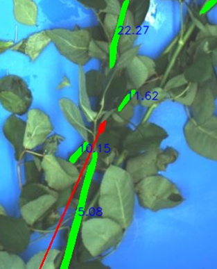 
<em>Fig. 17. The Crossroad Problem: Misalignment caused by PCA direction sensitivity.</em>

From the picture, we can tell that , in the upper area of this base stem, the candidate with the lowest score is not a true pair. So a `consistency identification` is set in the end of each iteration:

* **Pacth 1**: I a segment is matched in both its `upper` and `lower` sectors, the angular divergence between these two matches is evaluated. If the angular difference exceeds $20^\circ$ (a tuned heuristic), the match with the higher score is pruned from the graph and global list. This pruning allows the algorithm to re-evaluate the correct candidates in the following iteration.

 
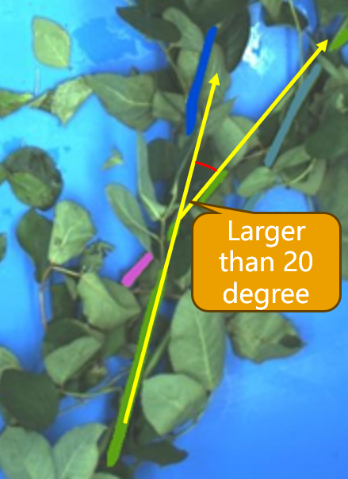
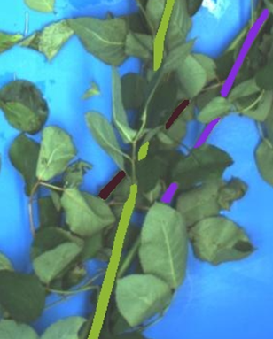 
<em>Fig. 18. Consistency Identification for Crossroad Mitigation.</em>

##### **Patch 2. Intermediate check for bridging problem**
The "bridging problem" occurs when a base stem skips an adjacent segment in favor of a lower-scoring distant candidate. 

 
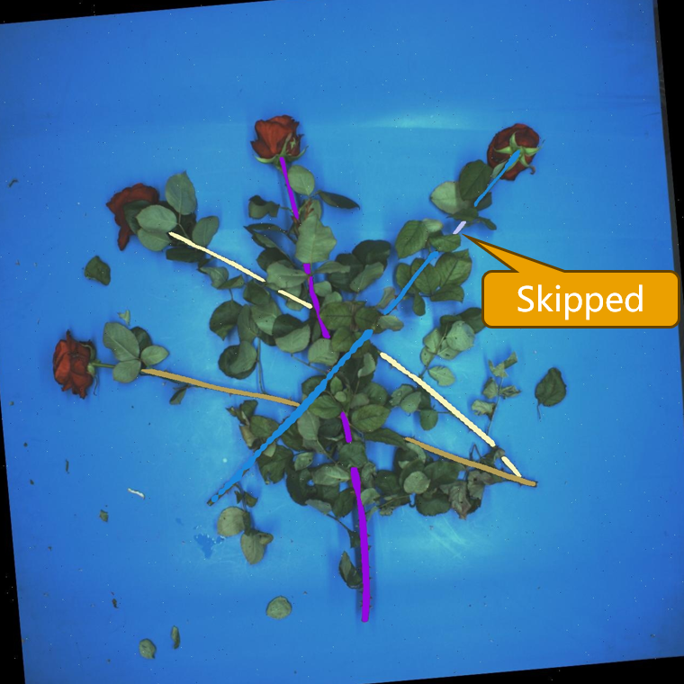
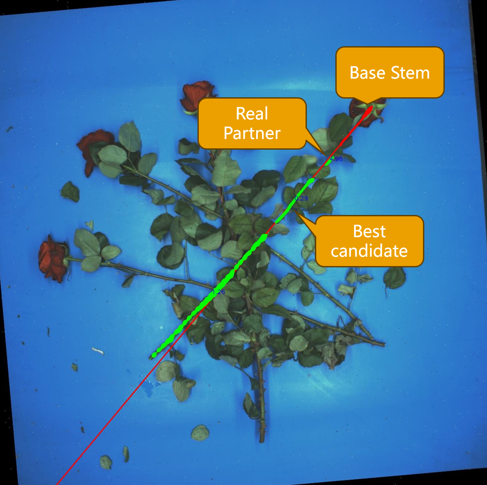 
<em>Fig. 19. Bridging Problem.</em>

To solve such bridging problem, I implement a `intermediate check`:

* **Pacth 2**: In one iteration, if stems $i$ and $j$ are paired, the algorithm searches for an intermediate stem $k$. If $k$ identifies both $i$ and $j$ as its optimal upper/lower matches with scores $< 20$, the segments are connected as a continuous chain ($i-k-j$).

To be notice, score = 20 here is a parameter selected after tunning. And this intermediate check is also further expanded into connecting stem i, j, k, s together if two stems in the middle are skipped. Then, that problem would be solved as:

 
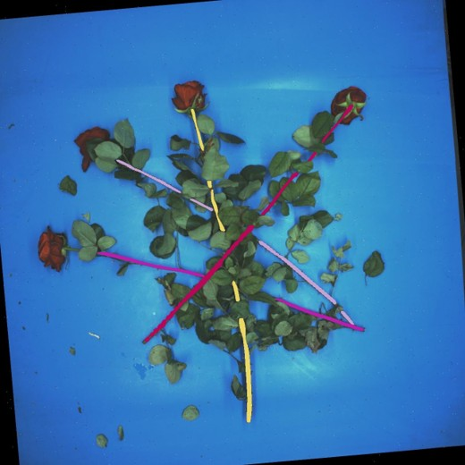 
<em>Fig. 20. The Bridging Problem: Utilizing intermediate checks to restore structural continuity.</em>

##### **Patch 3. Final matching by stem clusters**
Sometimes, when the iterations terminates, the stems belong to one flower cluster might end up with being paired into several groups. To unify fragmented groups belonging to the same flower, a final round of matching is conducted at the cluster level.

 
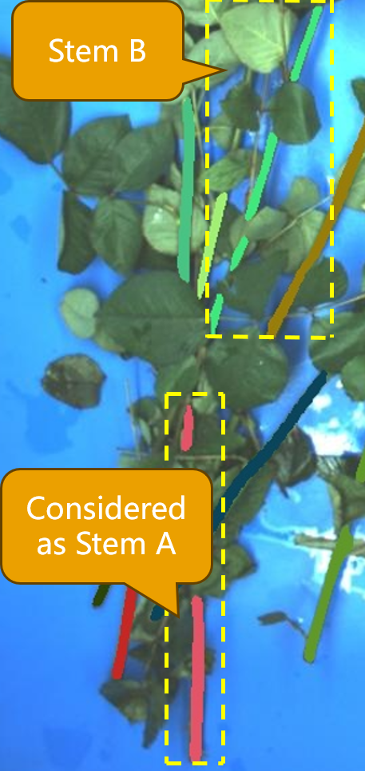
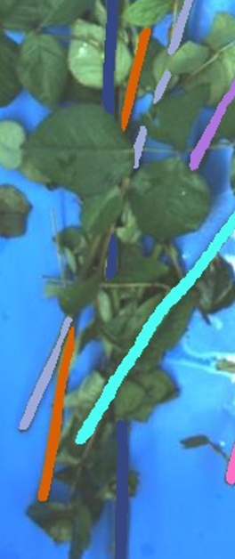 
<em>Fig. 21. inal matching: Consolidating fragmented stem clusters into unified instances.</em>

* **Pacth 3**: Each cluster identified in Phase 3 is treated as a single "composite stem." A global PCA direction is calculated for the entire cluster, and Phases 1 through 3 are repeated. This ensures that fragmented groups are consolidated into a final, singular flower structure.

#### **Performance of Algorithm 1**
To validate the efficacy of the `Stem Pairing` algorithm, an evaluation was conducted on 224 images enhanced with data augmentation.

The algorithm's ability to reconstruct flower structures was measured by comparing predicted clusters against ground truth annotations: 

* **Cluster Count**: 1,358 clusters were predicted relative to 1,282 ground truth instances.
* **Localization Success**: 1,239 predictions achieved an `Intersection over Union (IoU) $> 0.5$`, indicating high spatial overlap with the ground truth.

By analyzing the overlapping pixel areas between the predicted and ground truth masks, the statistical performance is: a `precision` of 0.899, a `recall` of 0.945, and an `F1 score` of 0.919. 

The results indicate a high recall (0.945), suggesting the algorithm successfully identifies most stem components. However, the slightly lower precision and the higher count of predicted clusters (1,358 vs. 1,282) reflect a tendency toward \textbf{over-segmentation}. In these cases, a single physical flower stem is occasionally partitioned into multiple discrete clusters rather than being unified as a single instance.

### Algorithm 2 - Top Selection
Algorithm 2 identifies the most accessible flower at the apex of the pile. This is achieved by evaluating the occlusion levels of each reconstructed stem cluster.  

 
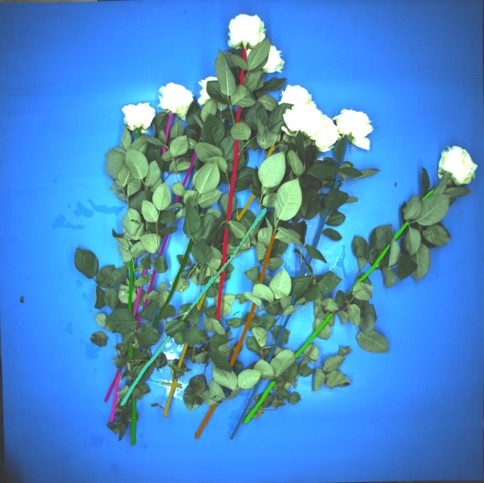
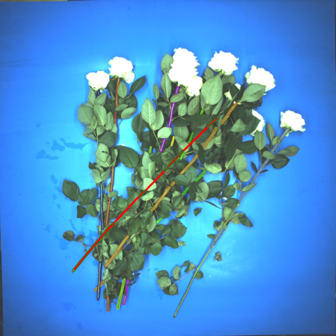 
<em>Fig. 22. Top Flower Selection.</em>

#### **Phase 1. Structural Reconstruction**
The intact flower stem is reconstructed from disjointed segment masks through the following steps:

* **Skeletonization**: The `skeletonize` function from the `scikit-image` library is applied to extract the medial axis of each segment contour.

* **Interpolation and Resampling:**: To bridge gaps between segments, the extracted axes are connected via interpolation and resampled at uniform intervals, resulting in a smooth, continuous skeleton representing the entire flower.

 
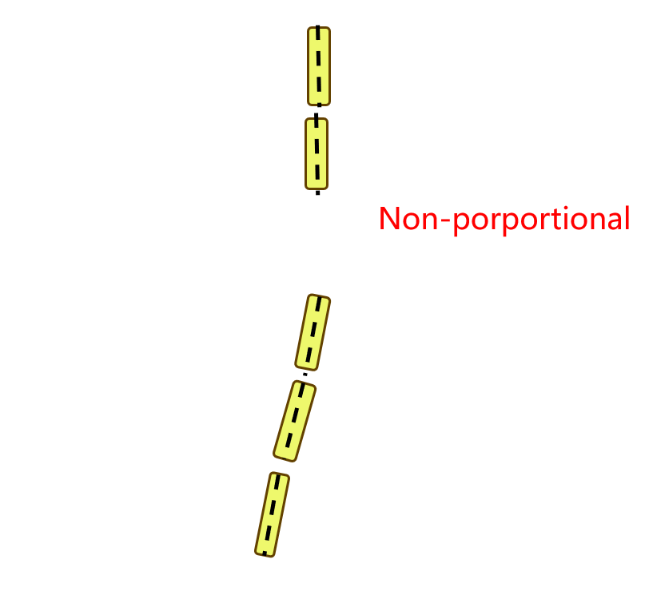
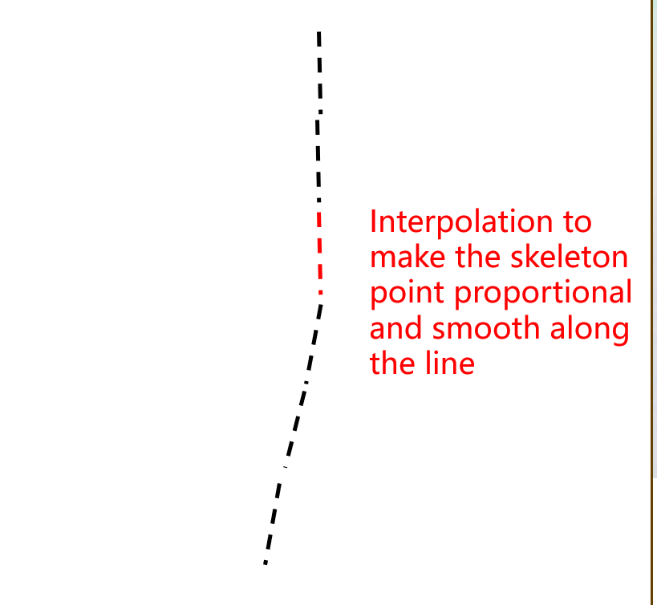 
<em>Fig. 23. Phase 1: Medial axis extraction (left) and spline-based resampling (right) to reconstruct the intact stem.</em>

#### **Phase 2. Compute the loss**
To quantify the accessibility of a flower, an `occlusion loss` is calculated. Each reconstructed skeleton is dilated to a fixed width of 4 pixels (a tuned parameter). The loss is defined as:

$$\mathcal{L}_{occlusion} = \text{Area} \left( \text{Stem}_{i} \cap \bigcup_{j \neq i} \text{Mask}_{j} \right)$$

The flower with the minimum loss is selected as the top-most instance. In cases where multiple candidates exhibit zero loss, the cluster with the largest total mask area is selected as the optimal target for picking.

 
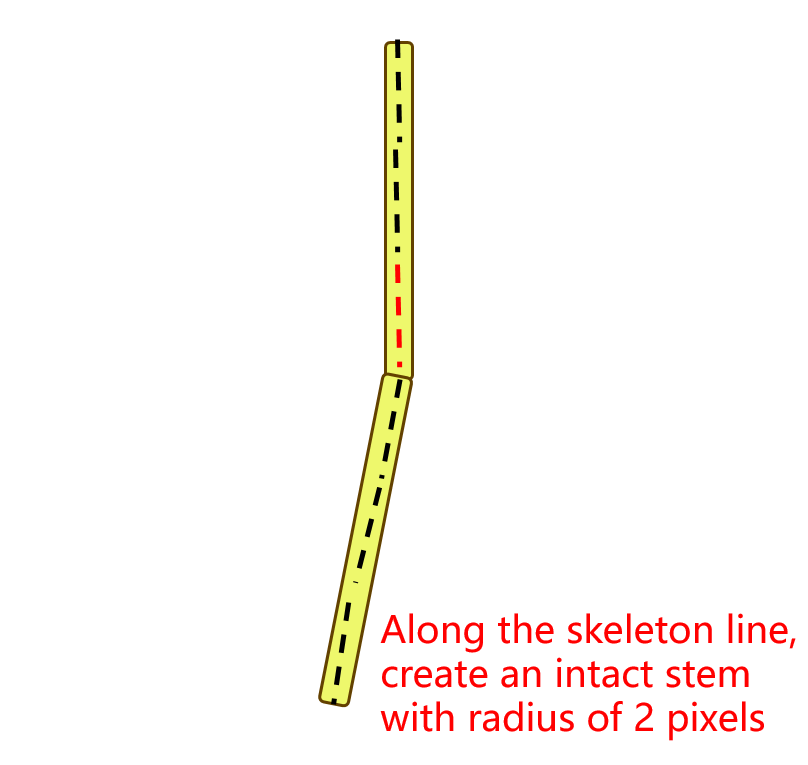
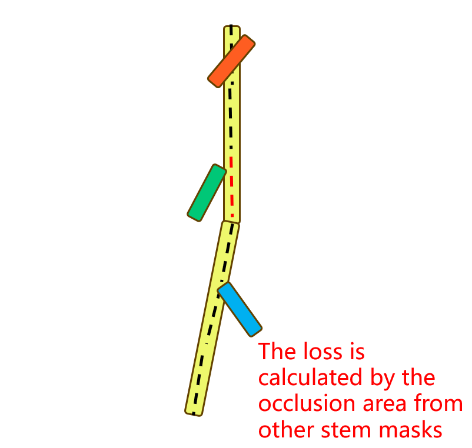 
<em>Fig. Phase 242: Definition of the stem search area (left) and visualization of the occlusion loss (right).</em>

#### **Performance of Algorithm 2**
The algorithm was evaluated on a dataset of 178 images. Using ground truth (GT) masks and clusters, `Top Selection` algorithm achieved a classification accuracy of 91\% compared to the manual annotations.

 
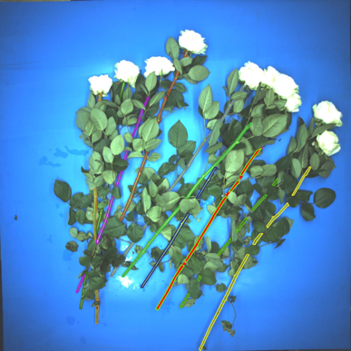
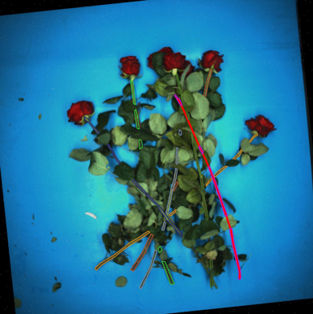 
<em>Fig. 25. Experimental results of the Top Selection algorithm: successful identification of the uppermost flower in cluttered environments.</em>

### Algorithm3 - Pick Point
The final stage of the pipeline calculates the optimal grasping coordinate, prioritizing both mechanical balance and the prevention of botanical damage.

Due to the non-uniform weight distribution and varying diameters of flower stems, the equilibrium point is empirically localized in the upper region. Given that reconstructed skeletons typically exhibit a slight truncation compared to the actual stem length, the picking point is theoretically established at the \textbf{upper 25\% mark} of the reconstructed medial axis.

To ensure the robotic gripper secures a stable and safe hold, the following refinement logic is implemented:

* **Spatial Verification**: If the theoretical coordinate resides outside the identified stem mask, the algorithm identifies the closest valid stem segment for relocation.
* **Contour Buffer**: To mitigate the risk of damaging leaves or the flower head, the picking point must not reside on the segment boundary. For relocated points, the final coordinate is set at 90\% of the radial distance from the segment contour toward its center line, ensuring a centered and secure grip.

 
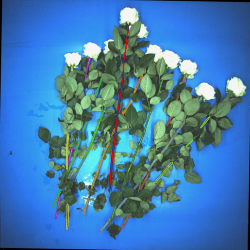  
&nbsp;&nbsp;&nbsp;&nbsp;&nbsp;&nbsp;&nbsp;&nbsp;
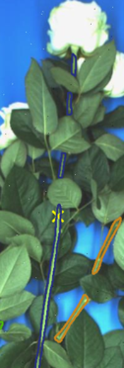 
<em>Fig. 26. Final picking point determination: balancing the center of gravity (left) with safe boundary margins (right).</em>

## Chapter 5 - Overall Performance
The integrated pipeline was evaluated to determine the cumulative effect of detection and post-processing on picking accuracy. 

* **Top Selection with Stem Pairing**: Given only the annotated masks, for the 178 images with data augmentation, the algorithm achieved 91.0\% accuracy on 178 augmented images, validating the logic of Algorithm 1 and 2.
* **Pipeline - Mask detection, Stem pairing and Top selection**: Given only the 175 raw images with data augmentation, the algorithm achieved 87.4% accuracy, reflecting the real-world robustness of the system.

To be noticed, an investigation into the 22 failure cases observed during the end-to-end pipeline testing reveals three primary bottleneck categories: 7/22 are due tominor segmentation inaccuracies (mask erosion or misalignment), 6/22 are due to the small error of mask detection and 5/22 problems are classified as unsolvable due to complex cross-occlusions, where the depth ordering was indistinguishable even for a human observer. Those will be explained in details in the next part

### Exception 1 - Structural Attrition in Long Stems

 
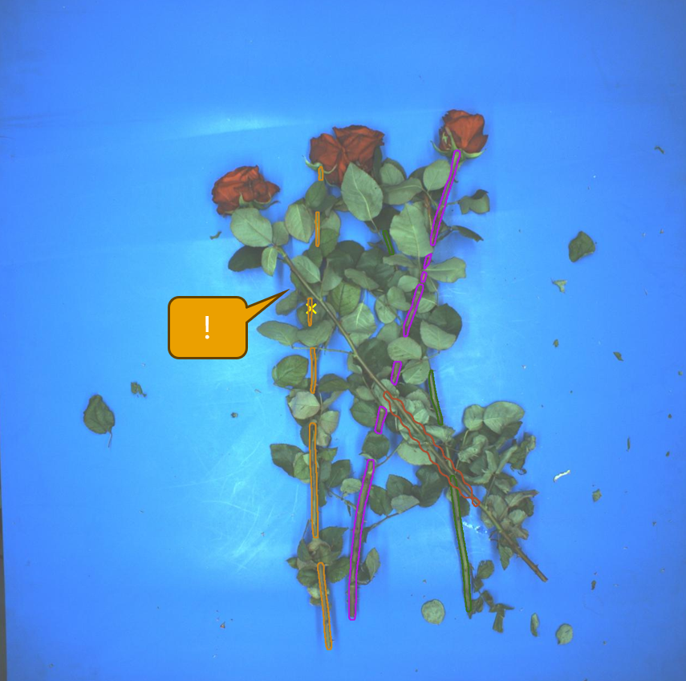
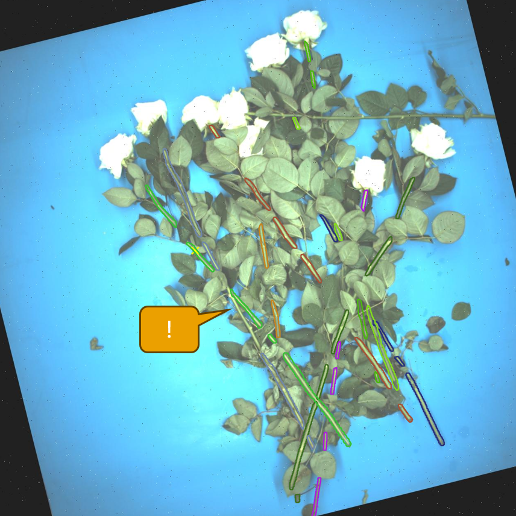 
<em>Fig. 27. Failure Case 1: Detection attrition where the dominant long stem is partially missing from the mask.</em>

As discussed in Chapter 4, the RoI Align process often simplifies long, inclined stems into fragmented pixels. High binary thresholds cause these segments to be discarded, leading to a failure in identifying the primary stem layer.  
To alleviate this, `mask\_thr\_binary` was optimized to 0.2.

## Exception 2 - Boundary Precision Errors

 
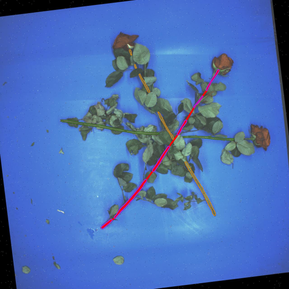
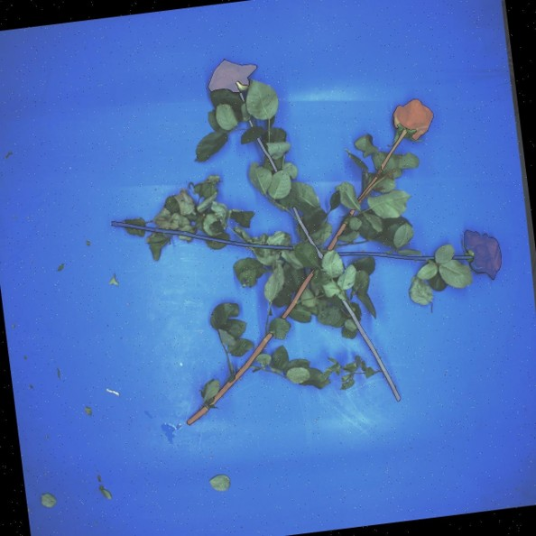 
<em>Fig. 28. Failure Case 2: Inaccurate selection due to minor mask detection errors at the stem terminals.</em>

Minor deviations in mask boundaries (mask erosion) can prevent the algorithm from detecting valid occlusions. A predicted mask that is slightly shorter than the ground truth may create an "artificial gap," allowing an underlying flower to be incorrectly prioritized.

## Exception 3 - Intersection Ambiguity

 
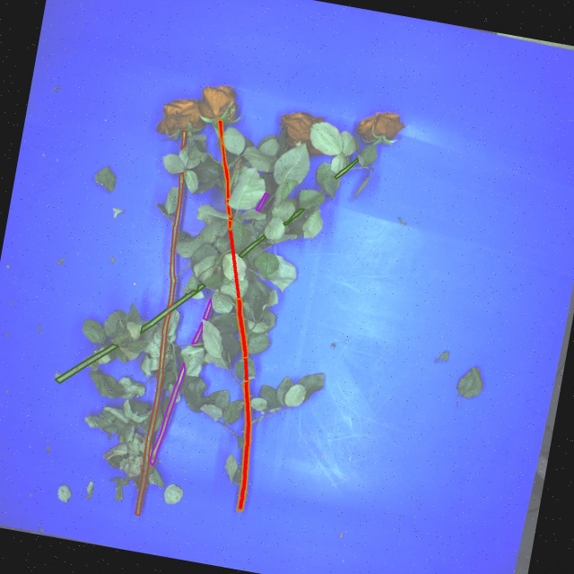
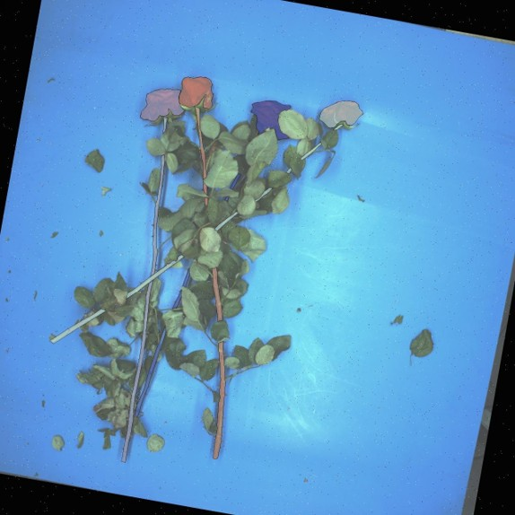 
<em>Fig. 3. Restriction of orientation error.</em>

In scenarios with complex cross-occlusions, even human observers struggle to determine the top-most instance based on 2D data alone. While the algorithm selects the candidate with the largest exposed area, subtle cues like shading are not yet accounted for, making these cases currently "insoluble."

## Chapter 6 - Conclusion and Future Work

While the current pipeline achieves an accuracy of 87.4\%, this margin of error implies that approximately one in ten cases may be misidentified. In a high-speed industrial work environment, such failure rates can lead to significant operational risks. Therefore, while the current results are promising, further enhancement is required for reliable deployment.

The primary target for future research is to improve `Instance Segmentation performance` by addressing the architectural defects of Mask R-CNN and YOLO and optimization of the post-processing algorithm:
* **Rotated Object Detection**: Utilizing `Rotated Bounding Boxes` within the Mask R-CNN framework could significantly improve the detection of inclined flower stems by providing a more precise fit than axis-aligned boxes.
* **Transformer Integration**: Combining `Transformers` with Mask R-CNN could leverage self-attention mechanisms to better handle global context and overlapping instances.
* **Algorithmic Refinement**: For post-processing, each algorithm offers a potential 10\% improvement margin through rigorous parameter tuning and logic optimization.